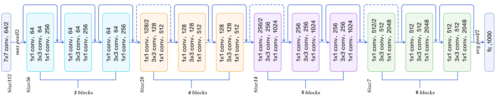
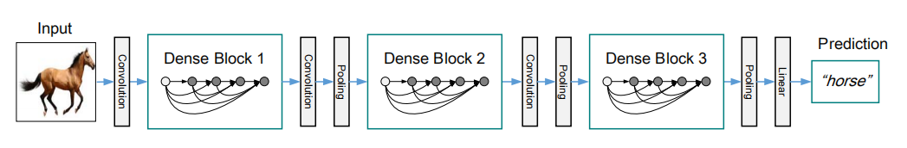
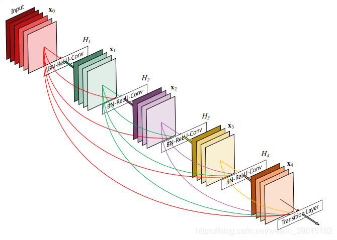

# CIFAR10分类
## 1. 模型结构介绍
### 1.1 ResNet-18

如图所示，ResNet网络是参考了VGG19网络，并且在其基础上进行了修改，主要改进在于通过短路机制加入了残差单元。
如图中，ResNet相比普通网络每两层间增加了短路机制，虚线就表示feature map数量发生了改变。  
ResNet直接使用stride=2的卷积做下采样，并且用global average pool层替换了全连接层。
当feature map大小降低一半时，feature map的数量增加一倍，这保持了网络层的复杂度。  
ResNet-18的详细结构解析如下：  
1. 原文中用的图像输入是3*224*224，先通过一个7*7*64的卷积，但是步长设置为2，使得图像的大小缩小了一半；
2. 在con2_x的刚开始，通过一个最大值池化，步长设置为2，使得图像又缩小了一半；
3. 然后是con2_x、con3_x、con4_x、con5_x一共8个残差块；
4. 按照作者说的，在con3_1、con4_1、con5_1都进行了2倍的下采样；
5. 最后一层先经过一个自适应平均池化层，然后一个全连接层映射到输出；
### 1.2 DenseNet
  

DenseNet不同于ResNet中的残差结构，也不同于GoogLetNet中的Inception网络结构。
DenseNet通过更密集的特征连接，使模型有了更好的性能，并且相比ResNet进一步减少了参数。  
DenseNet中有两个重要的结构，分别是Dense Block和Transition Layer
  

上图为DenseNet的Dense Block结构，DenseNet就是由多个这样的Dense Block结构组成，
它的核心思想就是后面每个层都会接受其前面所有层作为其额外的输入，
可以看到最后Transition Layer处，所有颜色的线都有，也就是前面所有层都作为输入。  
Transition layer由BN+Conv(1×1)+2×2 average-pooling组成。
Transition Layer将不同DenseBlock之间进行连接的模块，主要功能是整合上一个DenseBlock获得的特征，缩小上一个DenseBlock的宽高，达到下采样效果，特征图的宽高减半。

## 2. 模型效果展示
### 2.1 ResNet-18模型效果展示
该种方法下，模型测试准确率可以达到：
### 2.2 DenseNet模型效果展示
该种方法下，模型测试准确率可以达到：
## 3. 模型超参数对模型性能的影响
### 3.1 学习率
学习率过大导致无法收敛，原因是因为学习率大会导致模型学习数据时间加快，提前到达拟合点，
但是epoch没结束，继续学习训练数据，容易导致过拟合于原始数据。过小则导致收敛慢。
### 3.2 batch_size
模型对batchsize虽然没有学习率那么敏感, 但是进一步提高模型性能上, batchsize会变成一个非常关键的参数。
大的batchsize减少训练时间, 提高稳定性，但是泛化能力下降，小的batchsize则会使训练时间变长。
### 3.3 优化器
选择优化器的问题在于，由于no-free-lunch定理，没有一个单一的优化器可以在所有场景中超越其他的。
因此没有一劳永逸的解决方案，必须根据手头的特定问题仔细选择优化器。
根据目前观察目前SOTA所采用的一些优化器，发现广泛使用的是SGD优化器，因此比较了一下使用SGD优化器和Adam、Adagrad几种优化器时模型的性能。

